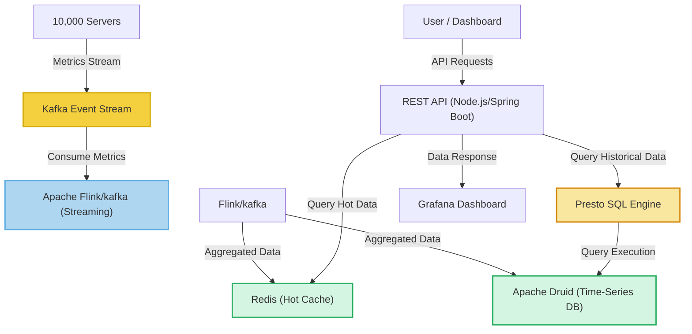

# System Design Solution: Data Center Monitoring & Metrics Aggregation

## **1️⃣ Understanding the Problem Statement**
- We have **10,000 servers** in a data center.
- Each server generates **2,000 metrics per second** (e.g., CPU usage, memory utilization).
- We need to **ingest**, **store**, and **process** this data in real-time for a dashboard.
- The system should allow querying for **min, max, and avg metrics** over a **2-day window** at **1-minute granularity**.

## **2️⃣ Functional & Non-Functional Requirements**
### ✅ **Functional Requirements (FRs)**
- **Ingest metrics** from 10,000 servers at a rate of **20 million data points per second** (10,000 × 2,000).
- **Efficient storage** to retain at least **2 days of data** (with 1-minute aggregation).
- **Query system** to return **min, max, avg metrics** based on:
  - A **server ID** within a **time range**.
  - A **metric ID** across **all servers** within a time range.
- **Dashboard API** for real-time visualizations.

### ✅ **Non-Functional Requirements (NFRs)**
- **Low Latency (<500ms query response time)**.
- **Scalability** to handle increasing servers/metrics.
- **Fault Tolerance** to handle server failures.
- **High Availability (99.99%)**.

---

## **3️⃣ Traffic Estimation & Storage Calculation**
### 🔹 **Incoming Data Rate**
- **10,000 servers × 2,000 metrics per second** = **20M data points per second**.
- Each metric entry (timestamp, server_id, metric_id, value) ≈ **16 bytes**.
- **Total Ingestion Rate** = 20M × 16B = **320MB per second**.

### 🔹 **Storage Calculation for 2 Days**
- **Total Metrics per Day** = 20M × 86,400 seconds ≈ **1.73 trillion records**.
- **Total Data per Day** = 320MB × 86,400 ≈ **27.6TB/day**.
- **For 2 days** → **~55TB**.

### 🔹 **Query Performance Consideration**
- Queries involve **aggregating data per minute**, so raw data is aggregated into **1-minute buckets** to reduce query complexity.

---

## **4️⃣ High-Level Architecture**
### 🔹 **Data Flow**
1. **Metrics Ingestion**  
   - Servers push data to **Kafka (event streaming system)**.
   - Kafka partitions the data to **multiple consumer nodes**.

2. **Data Processing & Aggregation**
   - **Apache Flink/Spark Streaming** reads from Kafka.
   - Data is **aggregated at 1-minute granularity**.
   - Precomputed **min, max, avg** values are stored in a **Time-Series Database (TSDB)**.

3. **Storage & Query Execution**
   - **Real-time metrics** → Stored in **Redis (for fast access)**.
   - **Historical data (2-day window)** → Stored in **Apache Druid / ClickHouse**.
   - Queries are executed using **Presto or Druid SQL**.

4. **Dashboard & APIs**
   - REST API (Node.js / Spring Boot) serves queries.
   - A front-end dashboard **(React, Grafana)** fetches and visualizes metrics.

---

## **5️⃣ Component Breakdown & Technology Stack**
| **Component**          | **Technology** |
|------------------------|---------------|
| **Metrics Ingestion**  | Kafka (Event Streaming) |
| **Stream Processing**  | Apache Flink / Spark Streaming |
| **Time-Series Storage** | Apache Druid / ClickHouse |
| **Fast Query Cache**   | Redis |
| **Query Engine**       | Presto |
| **API Layer**          | Node.js / Spring Boot |
| **Visualization**      | React / Grafana |

---

## **6️⃣ Scalability & Optimization Strategies**
✅ **Kafka Scaling** → Data is partitioned across Kafka topics for parallel ingestion.  
✅ **Precomputed Aggregations** → Avoids scanning raw data, reducing query time.  
✅ **Columnar Storage (Druid/ClickHouse)** → Stores data efficiently for fast queries.  
✅ **Hot vs. Cold Storage** →  
   - **Hot Data (last 2 hours) in Redis** for ultra-fast queries.  
   - **Cold Data (last 2 days) in Druid** for analytical queries.

---

## **7️⃣ Query Execution Examples**
### 🔹 Query 1: Get min, max, avg metrics for a server in the last 2 days
```sql
SELECT 
    server_id, metric_id, 
    MIN(value) AS min_value, 
    MAX(value) AS max_value, 
    AVG(value) AS avg_value
FROM druid_metrics
WHERE server_id = 'server123'
AND timestamp >= NOW() - INTERVAL '2 DAYS'
GROUP BY server_id, metric_id;
```

### 🔹 Query 2: Get min, max, avg for a specific metric across all servers
```sql
SELECT 
    metric_id, 
    MIN(value) AS min_value, 
    MAX(value) AS max_value, 
    AVG(value) AS avg_value
FROM druid_metrics
WHERE metric_id = 'cpu_usage'
AND timestamp >= NOW() - INTERVAL '2 DAYS'
GROUP BY metric_id;
```

---

## **8️⃣ High-Level Architecture Diagram (Mermaid)**


---

## **9️⃣ Trade-offs & Challenges**
| **Challenge**         | **Solution** |
|----------------------|-------------|
| **High Ingestion Rate (20M/s)** | Kafka partitions + Flink parallel processing |
| **Fast Queries on 55TB Data** | Precomputed aggregations + Columnar DB (Druid) |
| **Real-time vs. Historical Data** | Redis for hot data, Druid for 2-day queries |
| **Fault Tolerance** | Kafka replication + Multi-node processing |
| **Query Scalability** | Presto distributes workload for efficient SQL execution |

---

## **🔹 Summary & Explanation**
1. **Ingestion**: **Kafka** handles high-throughput metrics streaming.  
2. **Processing**: **Apache Flink** aggregates at **1-minute granularity**.  
3. **Storage**:  
   - **Redis (hot cache)** → Quick queries on recent data.  
   - **Druid/ClickHouse (cold storage)** → Large-scale analytical queries.  
4. **Query Execution**:  
   - **Presto SQL** processes **fast & large queries** on Druid data.  
5. **Visualization**: **Grafana connects to API** to display real-time dashboards.  
6. **Scalability**: Uses **event-driven architecture** with **pre-aggregations** to keep queries fast.

---

🚀 **This system can handle massive-scale data ingestion, real-time processing, and fast queries efficiently!** 🚀
